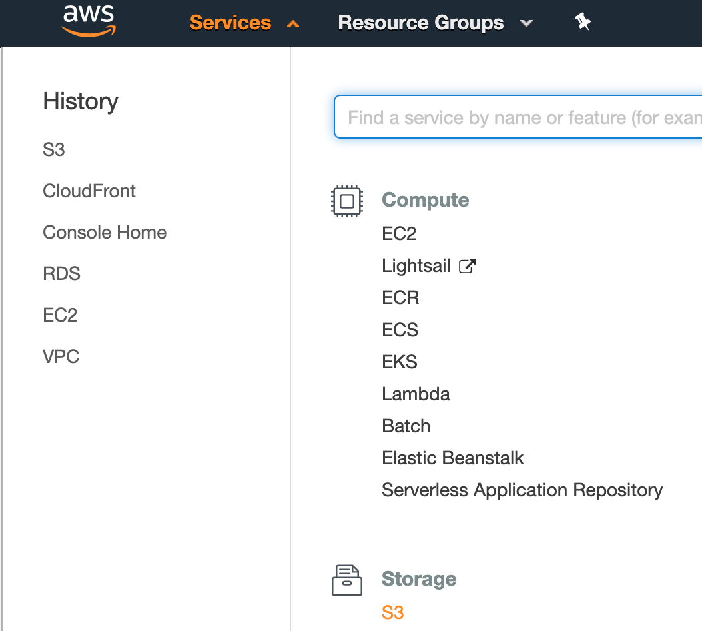
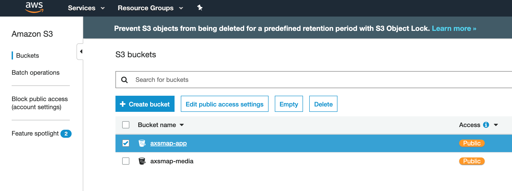
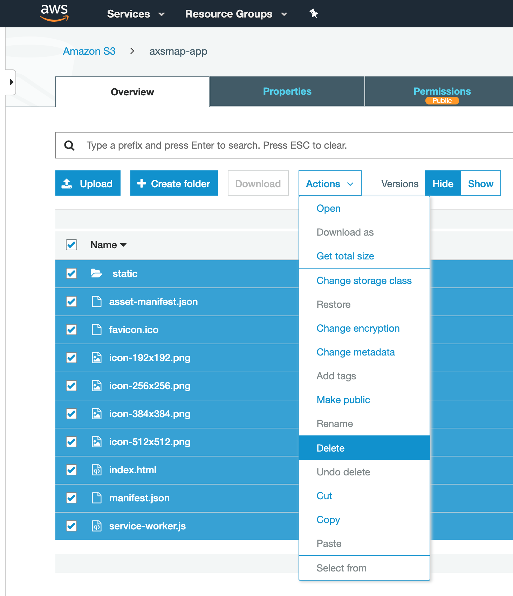
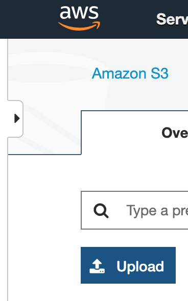
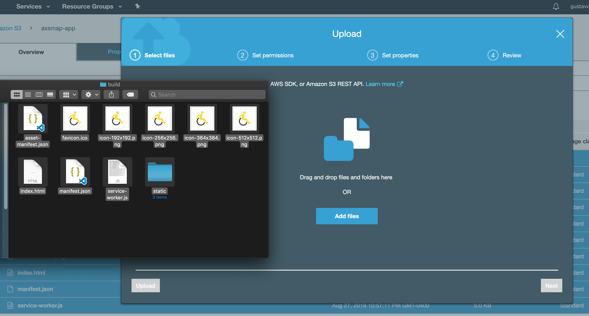
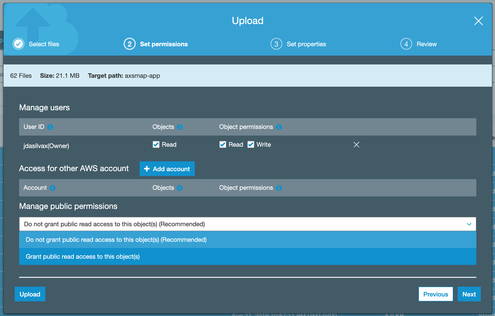
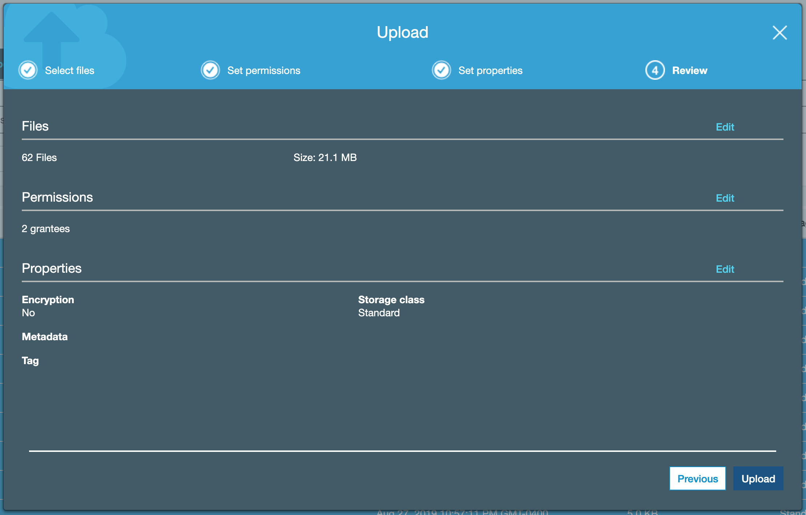
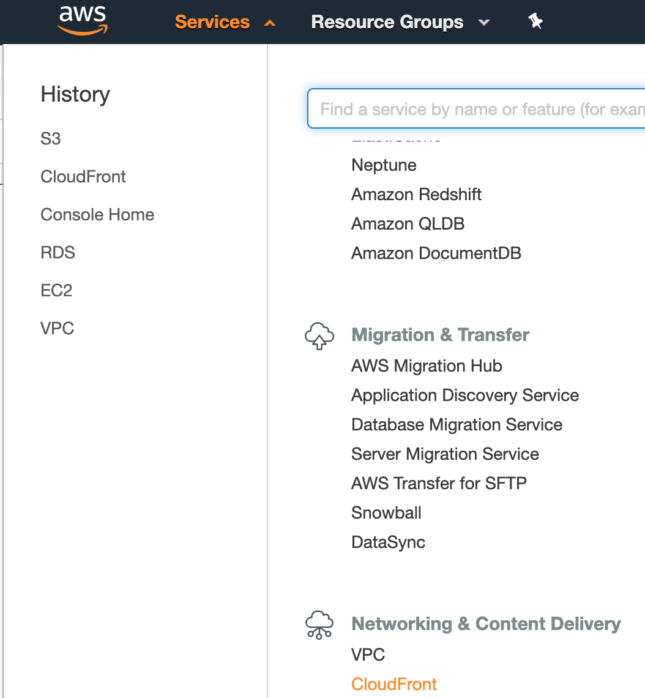
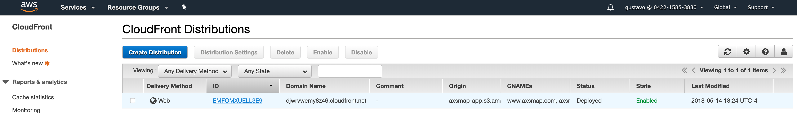
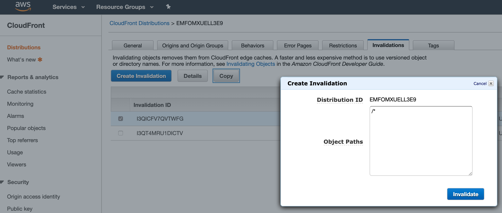

# AWS Deployment

## Steps

1. Go to the S3 page.   
2. Select the axsmap-app bucket.   
3. Choose all the files inside of it and delete them.   
4. After deleting the files, choose to upload new ones.   
5. Select all the files generated inside the build folder on the root path.   
6. In the second step (Set permissions) select **Grant public read access to this object(s)**.   
7. Click Next for the following steps until you end up in the final step. Then click Upload.   
8. After uploading the new files, go to CloudFront in other to invalidate the old files in the CDN.   
9. Click on the ID link.   
10. Go the Invalidations tab and select one of the options and finally click on Invalidate.   
